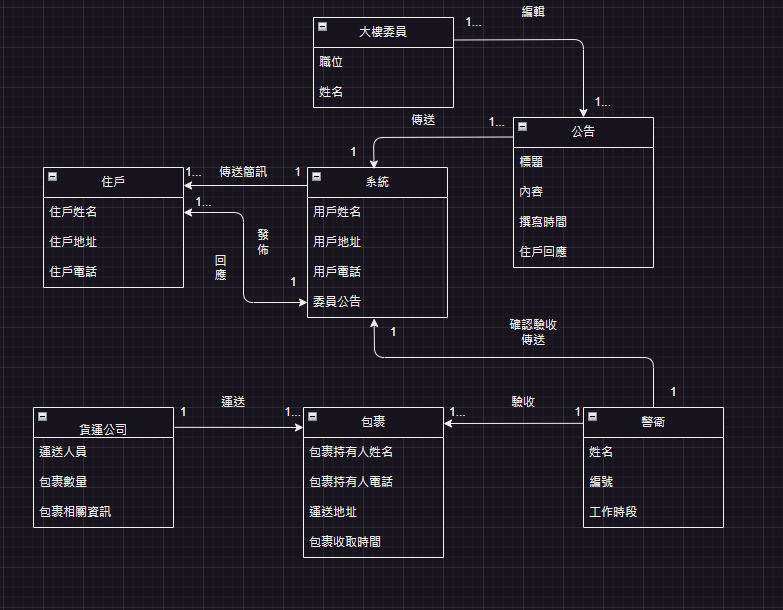

# 第4次作業-作業-HW4
>
>學號：111111116
> 
>姓名：劉泳辰
> 
>作業撰寫時間：180 (mins，包含程式撰寫時間)
> 
>最後撰寫文件日期：
>

本份文件包含以下主題：(至少需下面兩項，若是有多者可以自行新增)
- [x] 說明內容
- [x] 個人認為完成作業須具備觀念

1.請畫出初步類別圖

2.承第三次作業，請針對所撰寫的7組使用者案例，畫出5組系統循序圖，並撰寫每個方法的合約
